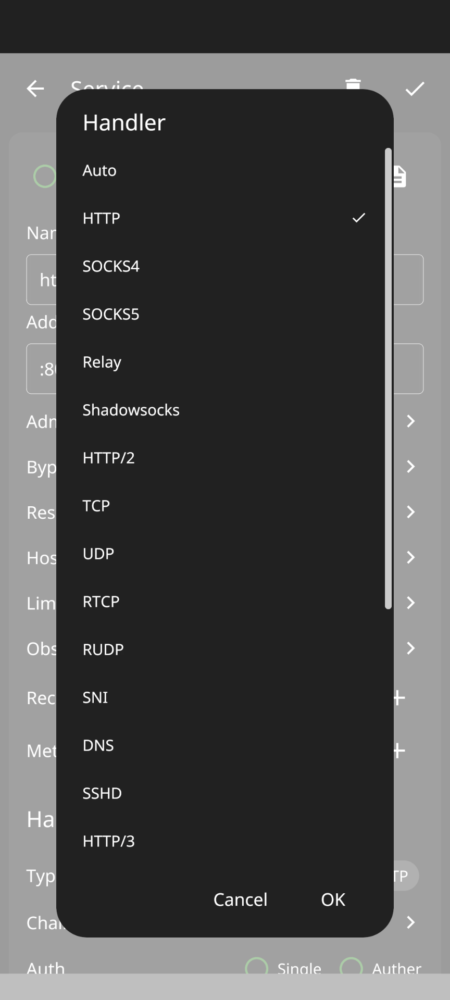
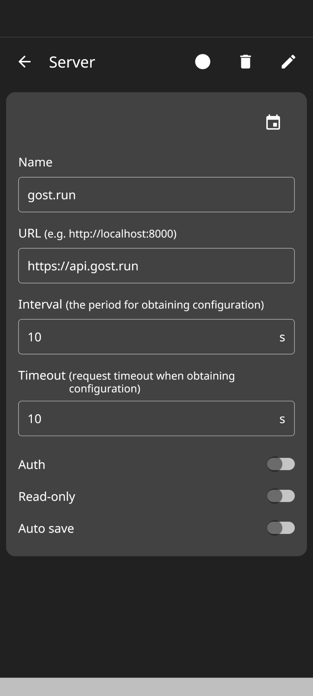
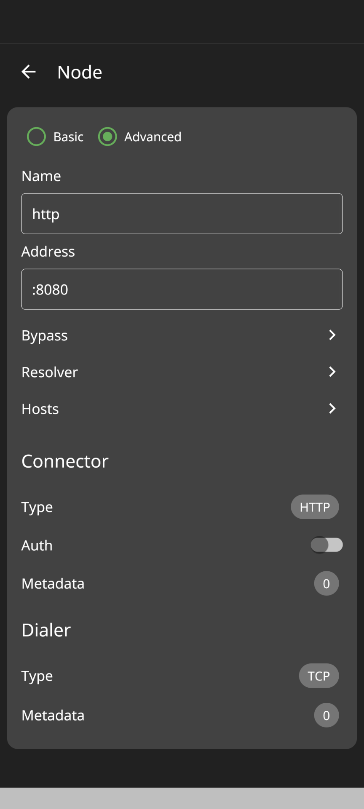

# GOSTCTL

### Official GUI client for GOST API management

## Installation

### Binary files

[https://github.com/go-gost/gostctl/releases](https://github.com/go-gost/gostctl/releases)

## YouTube Video

[https://www.youtube.com/watch?v=bA4rIWIlSN4](https://www.youtube.com/watch?v=bA4rIWIlSN4)

## Screenshot

